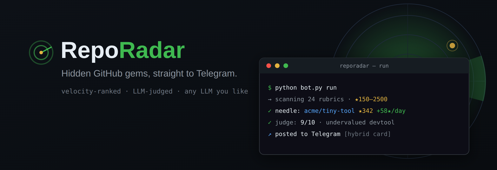
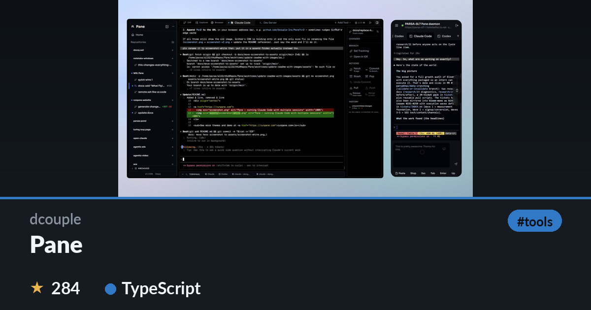
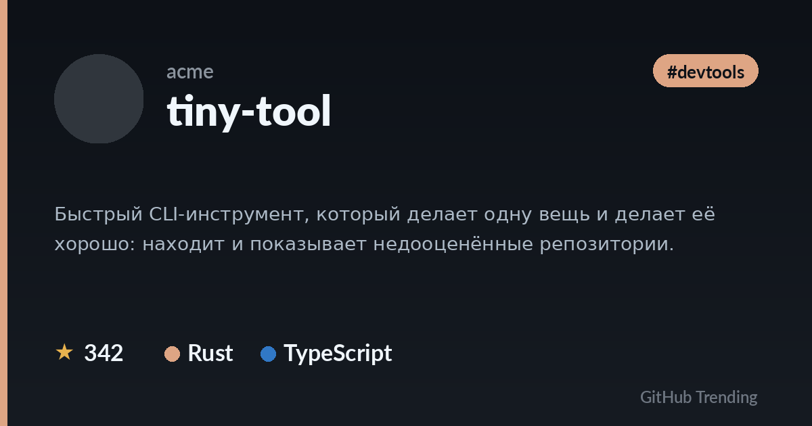

<p align="center">
  
</p>

<p align="center">
  
  
  
  
</p>

<p align="center">
  <b>English</b> &nbsp;·&nbsp; <a href="#reporadar--русский">Русский</a>
</p>

---

## RepoRadar

**RepoRadar finds undervalued GitHub repositories — the hidden gems, not the famous megastars — and posts them to a Telegram channel as clean image cards.**

Most "GitHub trending" bots repost the same giants everyone already knows (`kubernetes`, `next.js`, `go`...). RepoRadar does the opposite: it hunts the needle in the haystack — small but fast-growing or quietly excellent projects — ranks them by real momentum, has an LLM judge filter out the noise, and delivers them with a screenshot of the actual product.

### Features

- **Needle-in-haystack selection** — a narrow star window (default `150–2500`) so celebrities never make the cut.
- **Rocket / evergreen mix** — alternates between young fast-risers (`created` recently, high star-velocity) and old-but-alive underrated tools (fresh commits, low stars).
- **Velocity ranking + star-growth tracker** — ranks by stars/day; builds its own local history to measure real growth over time instead of guessing from age.
- **LLM judge** — every top candidate is scored 1–10 ("undervalued useful tool, or filler?") to keep clones, boilerplate and star-farmed junk out.
- **Hybrid cards** — pulls the real screenshot from the repo's README and adds a branded plate (owner, name, stars, languages). Falls back to a clean synthetic card when there's no screenshot.
- **Multi-language** — shows the real language stack (top 3), not just the primary language.
- **Any LLM** — works with any OpenAI-compatible endpoint. **Ollama by default** (local, free, no key). Groq, OpenAI, LM Studio, OpenRouter, together — one line of config.
- **Fully autonomous** — one run posts one repo; a scheduler (systemd / launchd / Task Scheduler) does the rest.

### Demo

Hybrid card (real screenshot from README + branded plate):



Synthetic card (when a repo has no screenshot):



### How it works

```
pick rubric + mode (rocket/evergreen)
  -> GitHub Search within star window
    -> score candidates (velocity or measured growth)
      -> LLM judge the top ones (drop below threshold)
        -> render card (hybrid screenshot if available)
          -> post to Telegram + remember it (dedup)
```

---

## Installation

### Requirements

- **Python 3.9+**
- A **Telegram bot** and a **channel** where it is an admin
- An **LLM** — local [Ollama](https://ollama.com) (default) or any OpenAI-compatible API

### 1. Get the code

```bash
git clone https://github.com/<owner>/reporadar.git
cd reporadar
pip install -r requirements.txt
cp .env.example .env
```

> On Windows use `py -m pip install -r requirements.txt`. On Linux/macOS a virtualenv is recommended: `python3 -m venv .venv && source .venv/bin/activate`.

### 2. Create the Telegram bot

1. Open [@BotFather](https://t.me/BotFather) -> `/newbot` -> copy the **token**.
2. Create a channel (or use an existing one) and **add the bot as an administrator** with permission to post.
3. Find the channel id:
   ```bash
   python bot.py chatid
   ```
   Post something in the channel after adding the bot; the numeric id looks like `-100...`.

### 3. Set up the LLM (default: Ollama)

```bash
# install Ollama from https://ollama.com, then:
ollama pull llama3.1
```

That's it — the default `.env` already points to `http://localhost:11434/v1`. To use another provider, see [Connect any LLM](#connect-any-llm).

### 4. Fill in `.env`

```ini
GH_TREND_BOT_TOKEN=123456:your-bot-token
GH_TREND_CHANNEL_ID=-1001234567890
```

### 5. Try it (no posting)

```bash
python bot.py preview    # picks a repo, writes preview.png, prints the caption
```

When happy, post for real:

```bash
python bot.py run        # posts exactly one repo to the channel
```

---

## Connect any LLM

RepoRadar talks to any **OpenAI-compatible** `/chat/completions` endpoint. Set three variables in `.env`:

| Provider | `LLM_BASE_URL` | `LLM_MODEL` | Key |
|---|---|---|---|
| **Ollama** (default, local) | `http://localhost:11434/v1` | `llama3.1` | not needed |
| **LM Studio** (local) | `http://localhost:1234/v1` | *(loaded model)* | not needed |
| **Groq** | `https://api.groq.com/openai/v1` | `llama-3.3-70b-versatile` | `LLM_API_KEY` |
| **OpenAI** | `https://api.openai.com/v1` | `gpt-4o-mini` | `LLM_API_KEY` |
| **OpenRouter** | `https://openrouter.ai/api/v1` | `meta-llama/llama-3.1-70b-instruct` | `LLM_API_KEY` |
| **together.ai** | `https://api.together.xyz/v1` | `meta-llama/Llama-3.3-70B-Instruct-Turbo` | `LLM_API_KEY` |

```ini
# Example: use Groq instead of Ollama
LLM_BASE_URL=https://api.groq.com/openai/v1
LLM_MODEL=llama-3.3-70b-versatile
LLM_API_KEY=gsk_your_key_here
```

- `LLM_API_KEY` — a single key, **or** point `LLM_API_KEY_FILE` to a file with one key per line (they are rotated on rate-limit).
- Set `USE_AI=0` to disable descriptions and the judge entirely (falls back to the repo's own GitHub description, no LLM calls).

---

## Run autonomously

One `python bot.py run` posts one repo. Schedule it (every ~3h is a good default).

### Linux — systemd

```bash
# edit the two paths inside these files first:
sudo cp deploy/reporadar.service /etc/systemd/system/
sudo cp deploy/reporadar.timer   /etc/systemd/system/
sudo systemctl daemon-reload
sudo systemctl enable --now reporadar.timer
systemctl list-timers reporadar.timer      # verify
```

### macOS — launchd

```bash
# edit the paths inside the plist first:
cp deploy/com.reporadar.plist ~/Library/LaunchAgents/
launchctl load ~/Library/LaunchAgents/com.reporadar.plist
```

### Windows — Task Scheduler

```powershell
schtasks /Create /SC HOURLY /MO 3 /TN RepoRadar ^
  /TR "py C:\path\to\reporadar\bot.py run" /ST 09:00
```

### Anything — cron

```cron
0 */3 * * * cd /path/to/reporadar && /usr/bin/python3 bot.py run
```

---

## Commands

| Command | What it does |
|---|---|
| `python bot.py run` | Pick the next repo and post it to the channel |
| `python bot.py preview` | Dry run: build the card into `preview.png` and print the caption (no posting) |
| `python bot.py fetch` | Show the current rubric's candidates with score / stars / age (no posting) |
| `python bot.py chatid` | Discover your channel's numeric id |
| `python bot.py whoami` | Check the bot token (`getMe`) |

`preview` and `fetch` accept `--offset N` to peek at other rubrics without moving the live cursor.

---

## Configuration

All options live in `.env` (see `.env.example`). Highlights:

| Variable | Default | Meaning |
|---|---|---|
| `NEEDLE_STARS_MIN` / `NEEDLE_STARS_MAX` | `150` / `2500` | Star window — the "invisibility band" where needles live |
| `NEEDLE_ROCKET_AGE` | `60` | Max age (days) for "rocket" candidates |
| `NEEDLE_ROCKET_STARS_MAX` | `1500` | Star ceiling for rockets |
| `NEEDLE_EVERGREEN_PUSH` | `90` | "Evergreen" repos must have been pushed within this many days |
| `NEEDLE_JUDGE_MIN` | `7` | Minimum LLM judge score (1–10) to publish |
| `NEEDLE_JUDGE_TOPK` | `6` | How many top-ranked candidates to send to the judge |
| `NEEDLE_SCREENSHOT` | `1` | `1` = hybrid card with README screenshot, `0` = synthetic card only |
| `USE_AI` | `1` | `0` disables all LLM calls |
| `GITHUB_TOKEN` / `GITHUB_TOKEN_FILE` | — | Optional GitHub token to raise the Search API rate limit |

### Customization

- **Rubrics** (topics/languages the bot rotates through) are the `RUBRICS` list in `bot.py`.
- Prefer even more obscure repos? Lower the star window (e.g. `50..1200`).
- Too much noise from the tail? Raise `NEEDLE_JUDGE_MIN` to `8`.

---

## License

MIT — see [LICENSE](LICENSE). Bundled fonts keep their own permissive licenses (see `assets/fonts/LICENSES.txt`).

<br>

---
---

<a name="reporadar--русский"></a>

## RepoRadar — Русский

**RepoRadar находит недооценённые репозитории GitHub — скрытые жемчужины, а не всем известные мегазвёзды — и публикует их в Telegram-канал аккуратными карточками-картинками.**

Большинство ботов про «тренды GitHub» постят одних и тех же гигантов, которых и так все знают (`kubernetes`, `next.js`, `go`...). RepoRadar делает наоборот: ищет иголку в стоге сена — небольшие, но быстрорастущие или тихо-качественные проекты, ранжирует их по реальному импульсу, отсеивает мусор LLM-судьёй и показывает со скриншотом самого продукта.

### Возможности

- **Отбор «иголка в сене»** — узкое окно звёзд (по умолчанию `150–2500`), чтобы знаменитости никогда не проходили.
- **Микс «ракеты / вечнозелёные»** — чередует молодых быстрорастущих (недавно созданы, высокая скорость набора звёзд) и старые, но живые недооценённые инструменты (свежие коммиты, мало звёзд).
- **Ранжирование по velocity + свой трекер прироста** — сортирует по звёздам в день; ведёт локальную историю, чтобы измерять реальный рост, а не гадать по возрасту.
- **LLM-судья** — каждый верхний кандидат оценивается по шкале 1–10 («полезная недооценённая находка или проходняк?»), чтобы отсечь клоны, шаблоны и накрученные звёздами репозитории.
- **Гибридные карточки** — берёт реальный скриншот из README и добавляет фирменную плашку (владелец, имя, звёзды, языки). Если скриншота нет — аккуратная синтетическая карточка.
- **Мульти-язык** — показывает реальный стек языков (топ-3), а не только основной.
- **Любая LLM** — работает с любым OpenAI-совместимым endpoint. **По умолчанию Ollama** (локально, бесплатно, без ключа). Groq, OpenAI, LM Studio, OpenRouter, together — одна строка конфига.
- **Полностью автономный** — один запуск = один пост; планировщик (systemd / launchd / Task Scheduler) делает остальное.

### Как это выглядит

Гибридная карточка (реальный скриншот из README + фирменная плашка):


Синтетическая карточка (когда у репозитория нет скриншота):


### Как работает

```
выбор рубрики + режима (ракета/вечнозелёный)
  -> поиск по GitHub в окне звёзд
    -> оценка кандидатов (velocity или измеренный рост)
      -> LLM-судья по верхним (отсев ниже порога)
        -> рендер карточки (гибрид со скриншотом, если есть)
          -> пост в Telegram + запоминание (дедуп)
```

---

## Установка

### Что нужно

- **Python 3.9+**
- **Telegram-бот** и **канал**, где бот — администратор
- **LLM** — локальная [Ollama](https://ollama.com) (по умолчанию) или любой OpenAI-совместимый API

### 1. Скачать код

```bash
git clone https://github.com/<owner>/reporadar.git
cd reporadar
pip install -r requirements.txt
cp .env.example .env
```

> На Windows: `py -m pip install -r requirements.txt`. На Linux/macOS желательно виртуальное окружение: `python3 -m venv .venv && source .venv/bin/activate`.

### 2. Создать Telegram-бота

1. Откройте [@BotFather](https://t.me/BotFather) -> `/newbot` -> скопируйте **токен**.
2. Создайте канал (или возьмите существующий) и **добавьте бота администратором** с правом публикации.
3. Узнайте id канала:
   ```bash
   python bot.py chatid
   ```
   После добавления бота напишите что-нибудь в канал; числовой id вида `-100...`.

### 3. Настроить LLM (по умолчанию Ollama)

```bash
# установите Ollama с https://ollama.com, затем:
ollama pull llama3.1
```

Готово — стандартный `.env` уже указывает на `http://localhost:11434/v1`. Другой провайдер — см. [Подключить любую LLM](#подключить-любую-llm).

### 4. Заполнить `.env`

```ini
GH_TREND_BOT_TOKEN=123456:ваш-токен-бота
GH_TREND_CHANNEL_ID=-1001234567890
```

### 5. Проверка (без публикации)

```bash
python bot.py preview    # выберет репо, соберёт preview.png, покажет подпись
```

Когда всё нравится — публикуем по-настоящему:

```bash
python bot.py run        # публикует ровно один репозиторий в канал
```

---

## Подключить любую LLM

RepoRadar общается с любым **OpenAI-совместимым** endpoint `/chat/completions`. Задайте три переменные в `.env`:

| Провайдер | `LLM_BASE_URL` | `LLM_MODEL` | Ключ |
|---|---|---|---|
| **Ollama** (по умолчанию, локально) | `http://localhost:11434/v1` | `llama3.1` | не нужен |
| **LM Studio** (локально) | `http://localhost:1234/v1` | *(загруженная модель)* | не нужен |
| **Groq** | `https://api.groq.com/openai/v1` | `llama-3.3-70b-versatile` | `LLM_API_KEY` |
| **OpenAI** | `https://api.openai.com/v1` | `gpt-4o-mini` | `LLM_API_KEY` |
| **OpenRouter** | `https://openrouter.ai/api/v1` | `meta-llama/llama-3.1-70b-instruct` | `LLM_API_KEY` |
| **together.ai** | `https://api.together.xyz/v1` | `meta-llama/Llama-3.3-70B-Instruct-Turbo` | `LLM_API_KEY` |

```ini
# Пример: Groq вместо Ollama
LLM_BASE_URL=https://api.groq.com/openai/v1
LLM_MODEL=llama-3.3-70b-versatile
LLM_API_KEY=gsk_ваш_ключ
```

- `LLM_API_KEY` — один ключ, **или** укажите `LLM_API_KEY_FILE` — файл с одним ключом на строку (ротация при rate-limit).
- `USE_AI=0` полностью отключает описания и судью (fallback на родное описание с GitHub, без обращений к LLM).

---

## Автономный запуск

Один `python bot.py run` = один пост. Запланируйте его (по умолчанию хорошо каждые ~3ч).

### Linux — systemd

```bash
# сначала отредактируйте два пути внутри файлов:
sudo cp deploy/reporadar.service /etc/systemd/system/
sudo cp deploy/reporadar.timer   /etc/systemd/system/
sudo systemctl daemon-reload
sudo systemctl enable --now reporadar.timer
systemctl list-timers reporadar.timer      # проверка
```

### macOS — launchd

```bash
# сначала отредактируйте пути внутри plist:
cp deploy/com.reporadar.plist ~/Library/LaunchAgents/
launchctl load ~/Library/LaunchAgents/com.reporadar.plist
```

### Windows — Планировщик заданий

```powershell
schtasks /Create /SC HOURLY /MO 3 /TN RepoRadar ^
  /TR "py C:\path\to\reporadar\bot.py run" /ST 09:00
```

### Где угодно — cron

```cron
0 */3 * * * cd /path/to/reporadar && /usr/bin/python3 bot.py run
```

---

## Команды

| Команда | Что делает |
|---|---|
| `python bot.py run` | Выбрать следующий репозиторий и опубликовать в канал |
| `python bot.py preview` | Тест: собрать карточку в `preview.png` и показать подпись (без публикации) |
| `python bot.py fetch` | Показать кандидатов текущей рубрики со score / звёздами / возрастом |
| `python bot.py chatid` | Узнать числовой id канала |
| `python bot.py whoami` | Проверить токен бота (`getMe`) |

`preview` и `fetch` принимают `--offset N`, чтобы заглянуть в другие рубрики, не двигая боевой курсор.

---

## Конфигурация

Все параметры в `.env` (см. `.env.example`). Главное:

| Переменная | По умолчанию | Смысл |
|---|---|---|
| `NEEDLE_STARS_MIN` / `NEEDLE_STARS_MAX` | `150` / `2500` | Окно звёзд — «полоса невидимости», где живут иголки |
| `NEEDLE_ROCKET_AGE` | `60` | Макс. возраст (дней) для «ракет» |
| `NEEDLE_ROCKET_STARS_MAX` | `1500` | Потолок звёзд для «ракет» |
| `NEEDLE_EVERGREEN_PUSH` | `90` | «Вечнозелёные» должны иметь коммиты в пределах стольких дней |
| `NEEDLE_JUDGE_MIN` | `7` | Минимальный балл судьи (1–10) для публикации |
| `NEEDLE_JUDGE_TOPK` | `6` | Сколько верхних кандидатов отправлять судье |
| `NEEDLE_SCREENSHOT` | `1` | `1` = гибрид со скриншотом README, `0` = только синтетическая карточка |
| `USE_AI` | `1` | `0` отключает все обращения к LLM |
| `GITHUB_TOKEN` / `GITHUB_TOKEN_FILE` | — | Необязательный токен GitHub для повышения лимита Search API |

### Кастомизация

- **Рубрики** (темы/языки, по которым бот идёт по кругу) — список `RUBRICS` в `bot.py`.
- Хочется ещё более неизвестных репозиториев? Опустите окно звёзд (например `50..1200`).
- Многовато шума из «хвоста»? Поднимите `NEEDLE_JUDGE_MIN` до `8`.

---

## Лицензия

MIT — см. [LICENSE](LICENSE). Вложенные шрифты сохраняют свои свободные лицензии (см. `assets/fonts/LICENSES.txt`).
